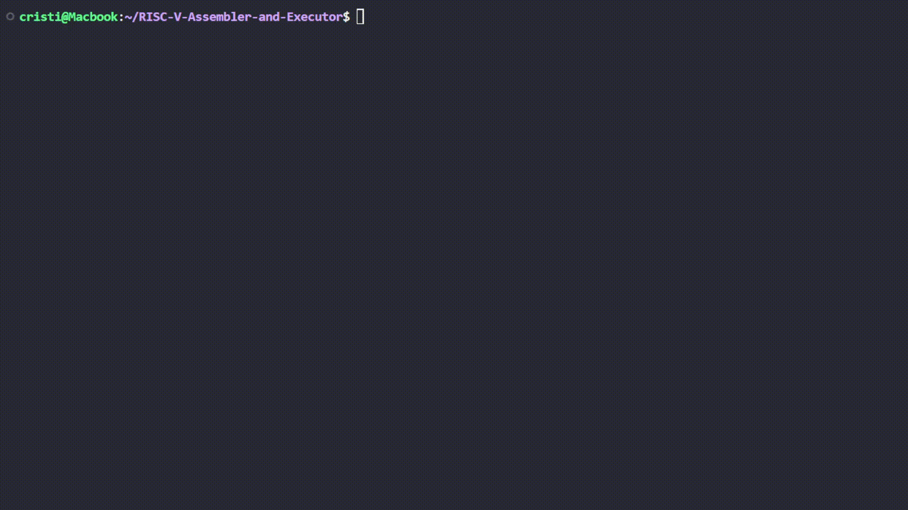

# RISC-V Assembler and Executor

## The objective of the project:
The project contains two scripts: one named "assambler", that transforms the RISC-V assembly to machine code using huffman coding, and the other named "executor", that decodes the instructions and executes them. The main.py script is used for providing a user interface(only on linux).

## Project completed by:
```
Andrei Cristian-David(143)
Gheorghe Bogdan-Alexandru(143)
Sincari Sebastian-George(143)
```

## Syntax for running the script:
```
python3 main.py
```


## Example RISC-V Assembly Programs
```
https://marz.utk.edu/my-courses/cosc230/book/example-risc-v-assembly-programs/
```

## 1. String Length

### Registers:
- Set the registers to 0 (!except "cml")

### Memory:
Hello world!\0
```
01001000011001010110110001101100011011110010000001110111011011110111001001101100011001000010000100000000
```
The result will be stored in the "a0" register

## 2. String Copy

### Registers:
- Set the "a0" register to 0 (destination adress)
- Set the "a1" register to 12 (source adress)
- Set the rest of the registers to 0 (!except "cml")

### Memory:
Hello world!\0Buna lume !\0
```
010010000110010101101100011011000110111100100000010101110110111101110010011001000010000100000000010000100111010101101110011000010010000001001100011101010110110101100101001000000010000100000000
```
The result will be stored in RAM

## 3. String Copy (n bytes)

### Registers:
- Set the "a0" register to 0 (destination adress)
- Set the "a1" register to 12 (source adress)
- Set the "a2" register to 4 (n)
- Set the rest of the registers to 0 (!except "cml")

### Memory:
Hello world!\0Buna lume !\0
```
010010000110010101101100011011000110111100100000010101110110111101110010011001000010000100000000010000100111010101101110011000010010000001001100011101010110110101100101001000000010000100000000
```
The result will be stored in RAM

## 4. Sum of an Integer Array

### Registers:
- Set the "a0" register to 0 (array adress)
- Set the "a1" register to 6 (array size)
- Set the rest of the registers to 0 (!except "cml")

### Memory:
[6, 5, 4, 2, 3, 1]
```
000000000000000000000000000001100000000000000000000000000000010100000000000000000000000000000100000000000000000000000000000000100000000000000000000000000000001100000000000000000000000000000001
```
The result will be stored in "a0"

## 5. Bubble Sort

### Registers:
- Set the "a0" register to 0 (array adress)
- Set the "a1" register to 6 (array size)
- Set the rest of the registers to 0 (!except "cml")

### Memory:
[6, 5, 4, 2, 3, 1]
```
000000000000000000000000000000000000000000000000000000000000011000000000000000000000000000000000000000000000000000000000000001010000000000000000000000000000000000000000000000000000000000000100000000000000000000000000000000000000000000000000000000000000001000000000000000000000000000000000000000000000000000000000000000110000000000000000000000000000000000000000000000000000000000000001
```
The result will be stored in RAM

## 6. Binary Search

### Registers:
- Set the "a0" register to 0 (array adress)
- Set the "a1" register to 3 (searched number)
- Set the "a2" register to 6 (array size)
- Set the rest of the registers to 0 (!except "cml")

### Memory:
[1, 2, 3, 4, 5, 6]
```
000000000000000000000000000000010000000000000000000000000000001000000000000000000000000000000011000000000000000000000000000001000000000000000000000000000000010100000000000000000000000000000110
```
The result will be stored in "a0"